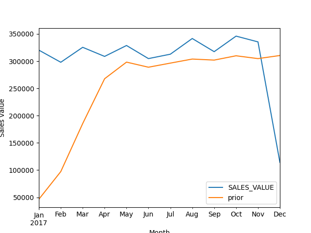

# retailer-sales-analysis
Time-series analysis of household retail transactions

## Project Overview
This project analyzes household-level retail transactions from frequent shoppers at a retailer.  
The dataset contains purchase records and demographics, and the goal is to explore **sales trends over time**.

## Analysis Steps
1. Load and clean the dataset (optimize types, convert dates).  
2. Perform exploratory analysis:  
   - Monthly sales trends  
   - Year-over-year comparison (2016 vs 2017)  
   - Day-of-week sales patterns  
3. Visualize findings using line and bar plots.

## Key Findings
- Sales increased steadily until late 2017, then slowed.  
- Sundays and Mondays generated the highest sales volume.  
- Seasonal patterns repeat year-over-year.

## Example Visualization
- 

## How to Run
1. Download the notebook:  
   ```bash
   git clone https://github.com/david95-coder/retailer-sales-analysis.git
